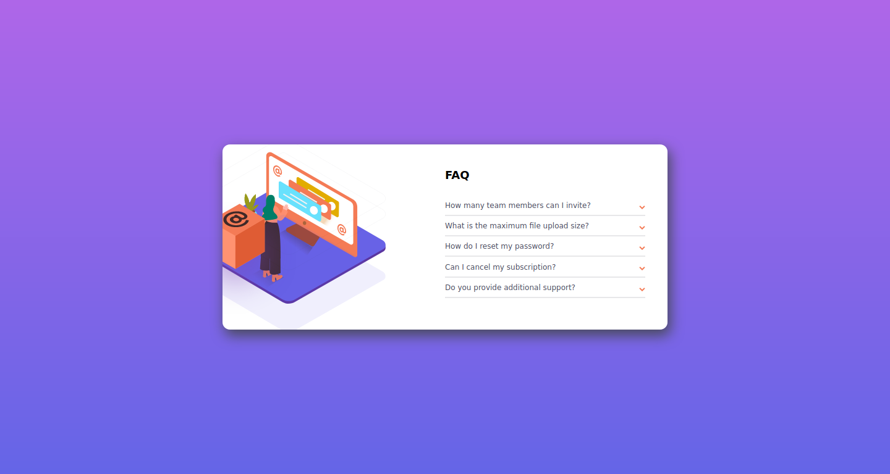
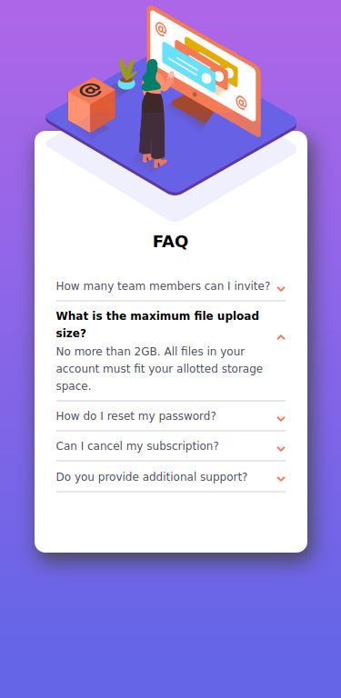

# Frontend Mentor - FAQ accordion card solution

This is a solution to the [FAQ accordion card challenge on Frontend Mentor](https://www.frontendmentor.io/challenges/faq-accordion-card-XlyjD0Oam). Frontend Mentor challenges help you improve your coding skills by building realistic projects.

## Table of contents

- [Overview](#overview)
  - [The challenge](#the-challenge)
  - [Screenshot](#screenshot)
  - [Links](#links)
- [My process](#my-process)
  - [Built with](#built-with)
  - [What I learned](#what-i-learned)
- [Author](#author)
- [Acknowledgments](#acknowledgments)

## Overview

### The challenge

Users should be able to:

- View the optimal layout for the component depending on their device's screen size
- See hover states for all interactive elements on the page
- Hide/Show the answer to a question when the question is clicked

### Screenshot

## Desktop

## Mobile

### Links

- Solution URL: [Solution URL here](https://github.com/gauravnumber/faq-accordion-card-main)
- Live Site URL: [Live site URL here](https://gauravnumber.github.io/faq-accordion-card-main)

## My process

### Built with

- Semantic HTML5 markup
- Flexbox
- [Sass](https://sass-lang.com/) - For styles

### What I learned

Using <picture> tag. More depth in flex. Importantance of Sass.

## Author

- Github - [Gaurav](https://www.github.com/gauravnumber)
- Frontend Mentor - [@gauravnumber](https://www.frontendmentor.io/profile/gauravnumber)
- Twitter - [@gauravnumber](https://www.twitter.com/gauravnumber)
